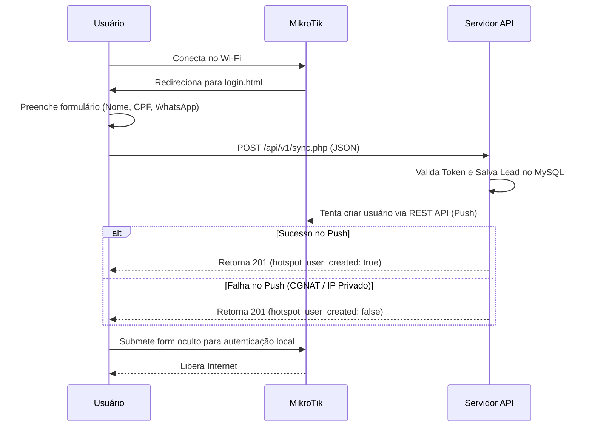

# Arquitetura e Fluxo de Dados

Este documento detalha o funcionamento interno do MegaHotSpot e como os dados fluem entre o usuário, o roteador MikroTik e o servidor central.

## 🏗️ Arquitetura Geral

O sistema é composto por três componentes principais:
1.  **Portal Captivo (MikroTik):** Interface HTML/JS hospedada no roteador que captura os dados do usuário.
2.  **Servidor Central (Hostinger):** API PHP que processa os leads, gerencia múltiplos estabelecimentos e centraliza o banco de dados.
3.  **Painéis Administrativos:** Interfaces web para o dono do negócio (Admin) e para a Mega Tecnologias (Super Admin).

## 🔄 Fluxo de Captura de Lead

## 📡 Sincronização Híbrida (Push vs Pull)

Para garantir que o sistema funcione tanto em redes com IP público quanto em redes atrás de CGNAT (NAT444), implementamos dois métodos de sincronização:

### 1. Modo Push (Sincronização Imediata)
*   **Como funciona:** No momento em que o lead é salvo, a API central tenta se conectar à REST API do MikroTik do cliente.
*   **Requisito:** O MikroTik deve ter um IP público acessível ou estar em uma VPN/Redirecionamento de porta.

### 2. Modo Pull (Sincronização via Scheduler)
*   **Como funciona:** Caso o modo Push falhe (ou o IP do MikroTik seja privado), o lead fica marcado como `pending` no banco.
*   **Mecanismo:** O MikroTik possui um Script + Scheduler que consulta o endpoint `/api/v1/pending_users.php` a cada 30 segundos.
*   **Vantagem:** Funciona em qualquer rede (Starlink, 4G, CGNAT), pois a conexão parte do roteador para o servidor.

## 🔐 Isolamento Multi-Tenant

Toda a arquitetura é baseada no `cliente_token` (UUID v4).
*   Cada estabelecimento tem seu próprio token.
*   O portal captivo envia este token no header `X-Auth-Token`.
*   O servidor usa este token para identificar o `estabelecimento_id` e garantir que um lead nunca seja gravado ou lido por outro cliente.
